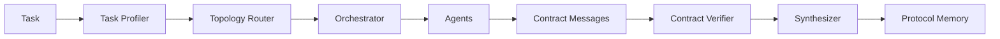

# Verifiable Multi-Agent Scaffold

This repository is the first runnable baseline for the new thesis direction:

> 面向复杂长程任务的可验证 LLM Agent 与多 Agent 协同架构研究

The current version is intentionally small. It runs without a model API and keeps the core research objects explicit:

- contract messages between agents
- adaptive topology routing
- planner / executor / verifier roles
- contract-level process verification
- protocol memory for reusable collaboration patterns

## Quick Start

```powershell
python -m pip install -e ".[dev]"
vma "Collect evidence, write a concise answer, and include verification notes."
pytest
```

## DeepSeek Backend

Set your key in the shell:

```powershell
$env:DEEPSEEK_API_KEY="sk-..."
vma "Plan, execute, and verify a research task." --backend deepseek --model deepseek-v4-flash --judge-model deepseek-v4-pro
```

`deepseek-v4-flash` is used for normal agent work. `deepseek-v4-pro` can be reserved for verifier and synthesizer roles when `--judge-model` is provided.

## Architecture



## Current Scope

The scaffold uses deterministic agents so the system can be tested before connecting real LLM backends. Replace `RuleBasedAgent` with an API-backed implementation once baseline logging and benchmark wrappers are stable.

## Observable Runs and Contract Reports

Each CLI run can now expose the collaboration trace without changing the topology router or agent decision logic:

```powershell
vma "请根据给定材料比较 AutoGen 和 CAMEL，并验证比较标准。" --backend mock --contract-report
vma "请根据给定材料比较 AutoGen 和 CAMEL，并验证比较标准。" --backend mock --json-trace
vma "请根据给定材料比较 AutoGen 和 CAMEL，并验证比较标准。" --backend mock --save-run
```

`--save-run` writes `runs/{run_id}/trace.json`. The JSON trace includes the task, task profile, selected topology, executed agents, contract messages, verification result, final answer, and metrics.

Example contract report:

```text
[Task Profile]
tool_need=0.60 | uncertainty=0.75 | risk=0.20 | complexity=0.54

[Topology]
selected=SUPERVISOR_WORKER
reason=multi-step task with moderate uncertainty

[Contract Report]
messages=4
supported_claims=3
support_rate=0.75
evidence_coverage=0.75
action_completeness=1.00
accepted=False
violations=["Executor#2 missing evidence"]

[Final Answer]
...
```

## Quantitative Router Stage 1

The quantitative router is available as an optional adapter layer. It emits a `TopologySpec`, then maps that spec back to the existing legacy topologies: `SINGLE_AGENT`, `SUPERVISOR_WORKER`, or `REVIEW_LOOP`. It does not implement a collaboration graph or dynamic graph execution.

```powershell
vma "比较 AutoGen 和 CAMEL 的架构差异，并给出适用场景。" --backend mock --router quant --contract-report
```

Example output:

```text
[Quantitative Router]
task_type=comparison
tci=0.365
capability_needs=['planning', 'verification', 'synthesis']
max_nodes=4 | max_edges=3 | max_review_loops=0 | max_tool_calls=0
blocked=False
block_reason=None
generation_reasons=['TCI=0.365 from horizon=0.75, dependency_depth=0.55, tool_burden=0.00, evidence_burden=0.20, uncertainty=0.50, risk=0.00', 'comparison', 'ordered_or_multiple_actions']
```

The TCI score is computed as:

```text
TCI = 0.20*horizon + 0.20*dependency_depth + 0.15*tool_burden + 0.15*evidence_burden + 0.15*uncertainty + 0.15*risk
```

For material-grounded tasks without supplied material, the spec is marked as blocked and normal agent execution is stopped with `accepted=False`.

## Quantitative Router Stage 2

`--router quant` now uses a constrained sequential graph execution path:

```text
TopologySpec -> CollaborationGraph -> GraphExecutor -> ContractReport / FinalAnswer
```

The default router path is unchanged. Graph execution is enabled only when `--router quant` is selected.

```powershell
vma "比较 AutoGen 和 CAMEL 的架构差异，并给出适用场景。" --backend mock --router quant --show-topology --contract-report
```

Example output:

```text
[Generated Topology]
Planner -> Executor -> Verifier -> Synthesizer
blocked=False

[Graph Execution]
executed_nodes=['planner', 'executor', 'verifier', 'synthesizer']
skipped_nodes=[]
review_loops_used=0
execution_mode=sequential_dag
```

The first graph executor supports only sequential DAG execution. It does not run nodes concurrently and does not allow arbitrary cycles. Review loops are bounded by `max_review_loops`.
