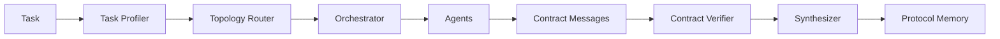

# Verifiable Multi-Agent Scaffold

This repository is the first runnable baseline for the new thesis direction:

> 面向复杂长程任务的可验证 LLM Agent 与多 Agent 协同架构研究

The current version is intentionally small. It runs without a model API and keeps the core research objects explicit:

- contract messages between agents
- adaptive topology routing
- planner / executor / verifier roles
- contract-level process verification
- protocol memory for reusable collaboration patterns

## Quick Start

```powershell
python -m pip install -e ".[dev]"
vma "Collect evidence, write a concise answer, and include verification notes."
pytest
```

## DeepSeek Backend

Set your key in the shell:

```powershell
$env:DEEPSEEK_API_KEY="sk-..."
vma "Plan, execute, and verify a research task." --backend deepseek --model deepseek-v4-flash --judge-model deepseek-v4-pro
```

`deepseek-v4-flash` is used for normal agent work. `deepseek-v4-pro` can be reserved for verifier and synthesizer roles when `--judge-model` is provided.

## Architecture



## Current Scope

The scaffold uses deterministic agents so the system can be tested before connecting real LLM backends. Replace `RuleBasedAgent` with an API-backed implementation once baseline logging and benchmark wrappers are stable.
