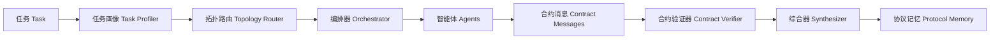

# 可验证多智能体协作框架

本仓库是新毕设方向的首个可运行基线：

> 面向复杂长程任务的可验证 LLM Agent 与多 Agent 协同架构研究

当前版本刻意保持精简。它无需模型 API 即可运行，并将核心研究对象显式化：

- 智能体之间的合约消息
- 自适应拓扑路由
- Planner / Executor / Verifier 角色
- 合约级过程验证
- 用于记录可复用协作模式的协议记忆

## 快速开始

```powershell
python -m pip install -e ".[dev]"
vma "收集证据，给出简明答案，并附上验证说明。"
pytest
```

## DeepSeek 后端

在 shell 中设置 API 密钥：

```powershell
$env:DEEPSEEK_API_KEY="sk-..."
vma "规划、执行并验证一项研究任务。" --backend deepseek --model deepseek-v4-flash --judge-model deepseek-v4-pro
```

`deepseek-v4-flash` 用于普通 agent 工作。当提供 `--judge-model` 时，`deepseek-v4-pro` 可保留给 verifier 和 synthesizer 角色使用。

## 架构



### 三种运行拓扑

| 拓扑 | 触发条件 | Agent 执行序列 |
|---|---|---|
| SINGLE_AGENT | 低复杂度、低风险 | Executor → Verifier |
| SUPERVISOR_WORKER | 中等复杂度（≥0.25）或多步骤（≥3） | Planner → Executor → Verifier |
| REVIEW_LOOP | 高风险（≥0.5）或高复杂度（≥0.55） | Planner → Executor → Verifier → Executor → Verifier |

若首次验证未通过且当前拓扑低于 REVIEW_LOOP，编排器会自动升级为 REVIEW_LOOP 进行重试。

### 合约消息模型

Agent 之间的每次通信均为 `ContractMessage`，包含以下字段：

- `role` — Planner / Executor / Verifier / Synthesizer
- `subtask` — 当前子任务描述
- `claim` — Agent 的主张
- `evidence` — 支撑主张的证据列表
- `action` — 采取的行动
- `uncertainty` — 不确定性评分（0~1）
- `budget_hint` — 预算提示

验证器要求支持率 ≥ 80% 且无缺失 action，合约才算通过。

## 当前范围

本框架使用确定性 agent（`RuleBasedAgent`），以便在接入真实 LLM 后端之前完成基线日志和基准测试包装器的测试与稳定工作。

切换至 LLM 后端后，`RuleBasedAgent.run()` 会自动委托给后端，同时注入 grounding 规则——确保每次 LLM 调用都锚定原始任务，不引入任务之外的新话题。
## 定量 Router 第一阶段

当前新增的定量 Router 是一个可选规格层，只输出 `TopologySpec`，不会替换旧的 `SINGLE_AGENT / SUPERVISOR_WORKER / REVIEW_LOOP` 执行路径，也不会实现动态图执行。

运行示例：

```powershell
vma "比较 AutoGen 和 CAMEL 的架构差异，并给出适用场景。" --backend mock --router quant --contract-report
```

示例输出：

```text
[Quantitative Router]
task_type=comparison
tci=0.365
capability_needs=['planning', 'verification', 'synthesis']
max_nodes=4 | max_edges=3 | max_review_loops=0 | max_tool_calls=0
blocked=False
block_reason=None
generation_reasons=['TCI=0.365 from horizon=0.75, dependency_depth=0.55, tool_burden=0.00, evidence_burden=0.20, uncertainty=0.50, risk=0.00', 'comparison', 'ordered_or_multiple_actions']
```

TCI 公式：

```text
TCI = 0.20*horizon + 0.20*dependency_depth + 0.15*tool_burden + 0.15*evidence_burden + 0.15*uncertainty + 0.15*risk
```

`CapabilityNeeds` 描述任务需要哪些能力，例如 `planning`、`tool_execution`、`material_grounding`、`verification`、`safety_review` 和 `synthesis`。

对于“根据给定材料”但没有提供材料的任务，`TopologySpec` 会标记：

```text
blocked=True
block_reason=missing material: task requires given material but no material content was provided
```

注意：第一阶段只生成规格，不改变 Orchestrator 的实际执行逻辑。
