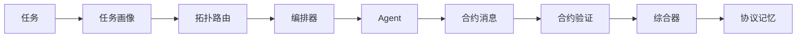

# 可验证多智能体协同架构

面向复杂长程任务的可验证多智能体协同架构研究 — 最小可运行基线。

## 核心模块

| 模块 | 说明 |
|------|------|
| **合约消息** | Agent 间结构化通信：主张（claim）+ 证据（evidence）+ 动作（action） |
| **任务画像** | 二维评估：复杂度（complexity）+ 验证难度（verifiability），规则或 LLM 驱动 |
| **拓扑路由** | 三种协作拓扑：SINGLE_AGENT / SUPERVISOR_WORKER / REVIEW_LOOP |
| **合约验证** | 双层验证：结构合规检查（零成本 rule-based gate）+ LLM 语义审计 |
| **协议记忆** | 检索历史相似任务，邻居失败率过高时自动升级拓扑 |
| **LLM Agent** | JSON 解析输出，与规则 Agent 接口统一，按后端自动切换 |

## 快速开始

```powershell
pip install -e ".[dev]"
vma "用三句话解释什么是二分查找。" --backend mock
pytest
```

## 后端

| 参数 | Agent | 说明 |
|------|-------|------|
| `--backend mock` | RuleBasedAgent | 零依赖，确定性模板，验证管线逻辑 |
| `--backend ollama` | LLMAgent | 本地 Ollama 推理 |
| `--backend vllm` | LLMAgent | 本地 vLLM 推理 |
| `--backend deepseek` | LLMAgent | DeepSeek API 云端推理 |

```powershell
# Mock 模式 — 无 LLM 依赖，快速跑通管线
vma "总结这段文本。" --backend mock

# DeepSeek 云端
$env:DEEPSEEK_API_KEY="sk-..."
vma "比较 AutoGen 和 LangGraph 的架构差异" --backend deepseek --router quant

# 本地 Ollama
vma "解释多 Agent 协同的优势" --backend ollama --model qwen3.5:4b
```

## 架构



## 任务画像

每个任务被评估为两个独立维度：

- **复杂度**（0–1）：任务有多难分解为子任务。因果推理、多步规划、跨领域综合 → 高；一句话总结 → 低
- **验证难度**（0–1）：输出有多难被验证正确性。核查/证伪某个说法 → 高（≥ 0.6）；比较/分析 → 中（0.3–0.5）；总结/定义 → 低（< 0.3）

mock 模式下使用关键词启发式规则。deepseek 模式下由 flash 模型做 few-shot 分类，输出 `{"complexity": x, "verifiability": y}`，解析失败时自动回退到规则评估。

## 拓扑路由

决策矩阵（阈值 0.4）：

| 复杂度 | 验证难度 | 拓扑 | 说明 |
|--------|---------|------|------|
| < 0.4 | < 0.4 | SINGLE_AGENT | 直接执行 + 轻量验证 |
| ≥ 0.4 | < 0.4 | SUPERVISOR_WORKER | 先规划再执行再验证 |
| 任意 | ≥ 0.4 | REVIEW_LOOP | 执行 → 审查 → 修订闭环 |

若首次验证未通过且当前拓扑低于 REVIEW_LOOP，编排器自动升级重试。

```powershell
vma "task" --router legacy          # 基础路由
vma "task" --router quant           # 量化路由 + 动态拓扑图生成
vma "task" --router quant --show-topology  # 展示生成的拓扑图
```

量化路由启用完整路径：`TaskProfile → TopologySpec → CollaborationGraph → GraphExecutor`。

## 路由记忆

系统在每次任务执行后将画像、拓扑选择、验证结果存入 `runs/memory.json`。新任务到来时：

1. 在 (complexity, verifiability) 二维空间中检索最近 3 条历史记录
2. 计算邻居中 accepted=False 的比例
3. 若失败率 > 50% 且当前拓扑非最高级，自动升级一级：`SINGLE_AGENT → SUPERVISOR_WORKER → REVIEW_LOOP`

默认启用，通过 `--no-routing-memory` 关闭。

## 合约消息模型

Agent 之间的每次通信均为 `ContractMessage`，包含以下字段：

- `role` — Planner / Executor / Verifier / Synthesizer
- `subtask` — 当前子任务描述
- `claim` — Agent 的主张
- `evidence` — 支撑主张的证据列表
- `action` — 采取的动作
- `uncertainty` — 不确定性评分（0–1）

验证器逐条检查 evidence 与 claim 的关键词重叠，support_rate = 有效支撑条数 / evidence 总条数。support_rate ≥ 0.5 且无缺失 action 方可通过。

## 合约报告

```powershell
vma "比较 AutoGen 和 LangGraph 的架构差异并验证比较标准。" \
    --backend mock --router quant --contract-report
```

```text
[Task Profile]
complexity=0.45 | verifiability=0.33

[Topology]
selected=SUPERVISOR_WORKER
reason=complexity=0.45, verifiability=0.33 → SUPERVISOR_WORKER

[Contract Report]
messages=4
support_rate=0.75
accepted=True

[Final Answer]
...
```

## 可观测运行

```powershell
vma "task" --backend mock --contract-report   # 合约报告
vma "task" --backend mock --json-trace        # JSON 完整轨迹
vma "task" --backend mock --save-run          # 持久化到 runs/{run_id}/trace.json
```

## 冒烟测试

10 条中文任务，覆盖五种类型，验证画像 → 路由 → 执行全流程：

| 类型 | 编号 | 期望路由 |
|------|------|---------|
| 事实比较 | T01–T02 | SUPERVISOR / REVIEW |
| 多跳推理 | T03–T04 | SUPERVISOR / REVIEW |
| 开放分析 | T05–T06 | SINGLE / SUPERVISOR |
| 验证挑战 | T07–T08 | REVIEW |
| 路由边界 | T09–T10 | SINGLE / REVIEW |

```powershell
python scripts/smoke_test.py                  # 全部 10 条（需要 DEEPSEEK_API_KEY）
python scripts/smoke_test.py -k "T09"         # 单条调试
python scripts/smoke_test.py --backend all    # 多后端横向对比
```

每条任务输出 CSV 行，汇总结果写入 `runs/smoke_results.csv`。

## 测试

```powershell
pytest                          # 全部 72 项
pytest tests/test_memory.py     # 路由记忆
pytest tests/test_llm_agent.py  # LLM Agent 集成
```
